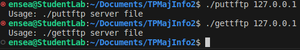
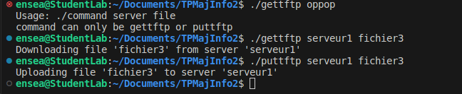
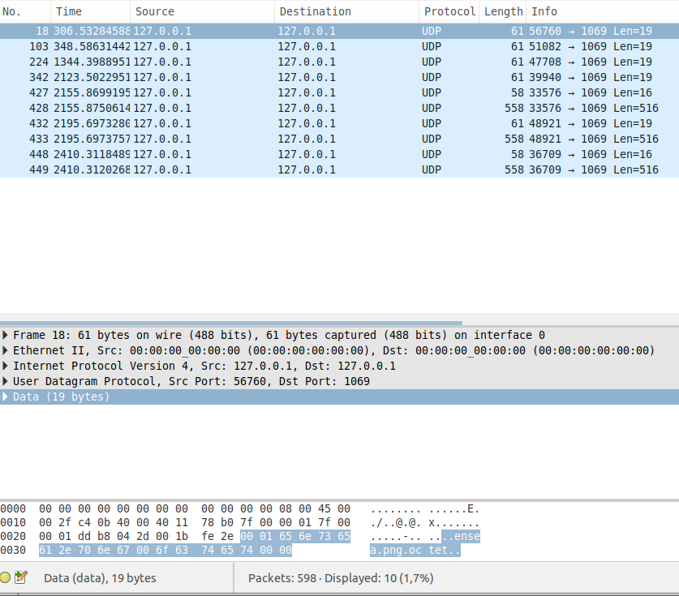

# TPMajInfo2 - TFTP Client Implementation

## Table of Contents
1. [Overview](#overview)
2. [Usage](#usage)
3. [Features Implemented](#features-implemented)
   - [1. Command-line Arguments](#command-line-arguments)
   - [2. Server Address Resolution](#server-address-resolution)
   - [3. Socket Creation](#socket-creation)
   - [4. Downloading a File (gettftp)](#downloading-a-file-gettftp)
4. [References](#references)

## 1. Overview
This project involves the development of a Trivial File Transfer Protocol (TFTP) client capable of exchanging files with a server. The client supports both downloading and uploading files using RFC specifications and incorporates various TFTP options. The implementation is based on several RFCs, including RFC1350 (TFTP v2), RFC2347 (TFTP Option Extension), RFC2348 (TFTP Blocksize Option), RFC2349 (TFTP Timeout & Tsize Options), and RFC7440 (TFTP Windowsize Option).

## 2. Usage
The TFTP client consists of two command-line programs:
- `gettftp`: Used for downloading a file from the server.
- `puttftp`: Used for uploading a file to the server.

## 3. Features Implemented

### 3.1 Command-line Arguments
Both `gettftp` and `puttftp` programs accept command-line arguments to specify the server and the file to be downloaded or uploaded.

### 3.2 Server Address Resolution
The `getaddrinfo` function is used to obtain the server's address based on the provided hostname.

### 3.3 Socket Creation
A connection socket to the server is created using the socket function.

### 3.4 Downloading a File (gettftp)
a) The client builds a properly formed Read Request (RRQ) packet and sends it to the server.

b) For single Data (DAT) packet files, the client receives the file along with its acknowledgment (ACK).

c) For multiple Data (DAT) packet files, the client receives each data packet and sends the respective acknowledgment (ACK).

## 4. References
1. RFC1350: TFTP v2
2. RFC2347: TFTP Option Extension
3. RFC2348: TFTP Blocksize Option
4. RFC2349: TFTP Timeout & Tsize Options
5. RFC7440: TFTP Windowsize Option

